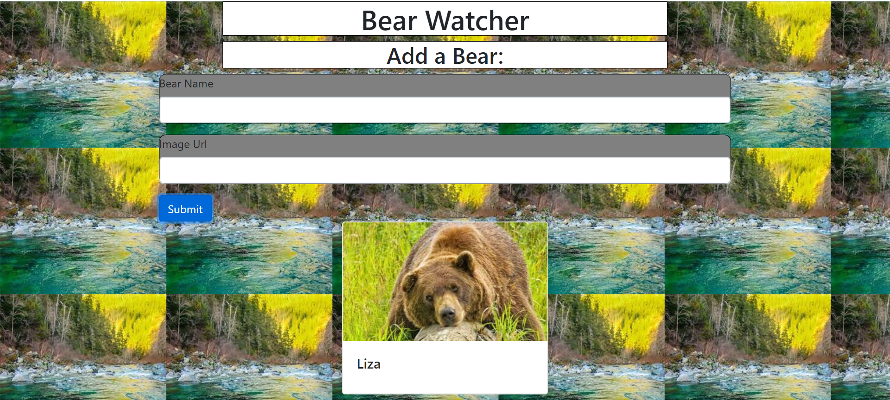

# bear-watcher

## Description
This project allows users to add bears they want to watch to a river.  The river allows users to check on the bear they have added.
## Screenshots

## How To Run
1. Clone down this repo
1. Make sure you have  http-serve installed via npm. If not, get it [HERE](https://npmjs.com/package/http-server).
1. On your command line run `hs -p 9999`
1. In your browser go to `http://localhost:9999`